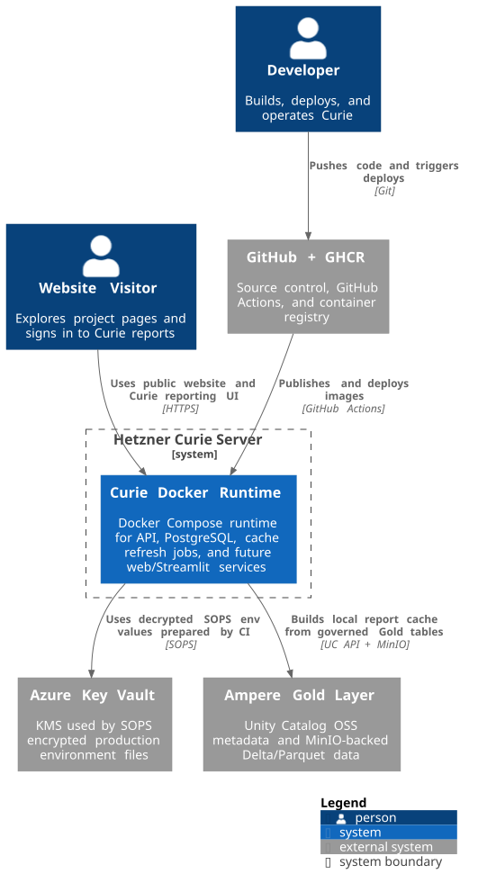
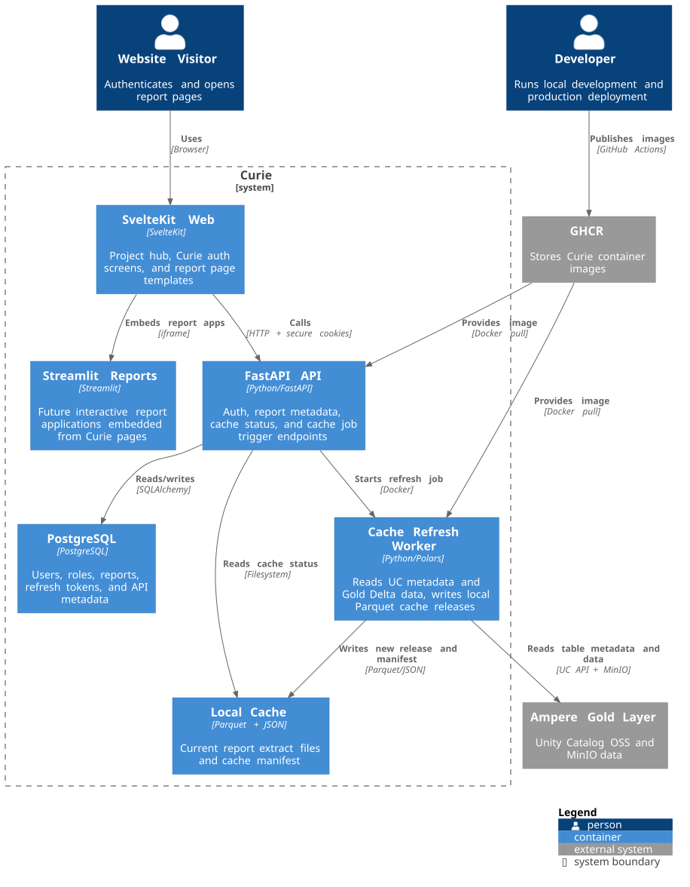

# Curie Documentation

## Overview

Architecture and frontend documentation for Curie, a small full-stack reporting platform that combines a SvelteKit public website, FastAPI backend, PostgreSQL metadata store, Streamlit report dashboards, and a local Parquet serving cache.

The diagrams explain how Curie sits between public users and the Ampere data platform, how the runtime containers interact, and where report metadata, authentication, cache refresh, and embedded dashboards fit into the system.

## Diagram Inventory

| View | Focus | Source | Rendered Output |
| --- | --- | --- | --- |
| System Context | Public user, developer, Ampere upstream data platform, GitHub Actions, and Curie production boundary | [`docs/diagrams/context.puml`](diagrams/context.puml) | `docs/images/CurieContext.svg` |
| Container View | SvelteKit web, FastAPI API, PostgreSQL, cache refresh worker, local cache, Streamlit reports, and Nginx routing | [`docs/diagrams/containers.puml`](diagrams/containers.puml) | `docs/images/CurieContainers.svg` |

## Diagrams

[](images/CurieContext.svg)

[](images/CurieContainers.svg)

## Frontend Styling

SvelteKit and Streamlit owned CSS follows BEM naming. See:

```text
docs/frontend-styling.md
```

The local BEM source notes used for the current convention are:

```text
.local/BEM naming.md
.local/BEM FAQ.md
```

## Rendering

Curie architecture diagrams use PlantUML with C4-PlantUML conventions. Source diagrams live in `docs/diagrams`, and rendered SVG files live in `docs/images`.

The rendered SVGs are generated artifacts. Edit the `.puml` files, then let the GitHub Actions diagram workflow refresh the SVG output after push.
